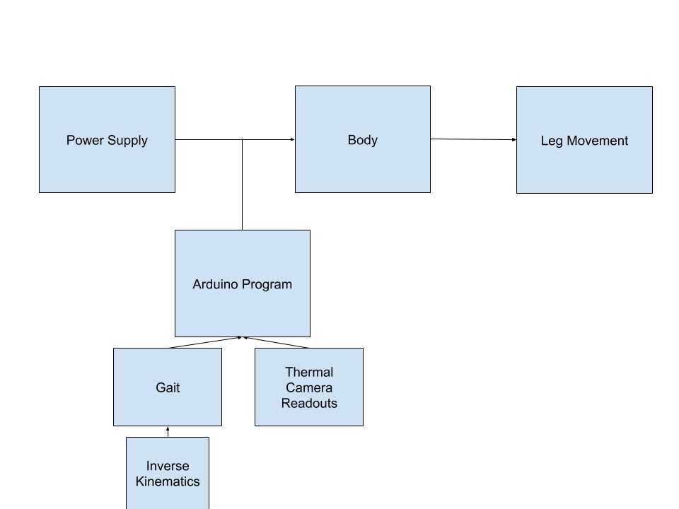
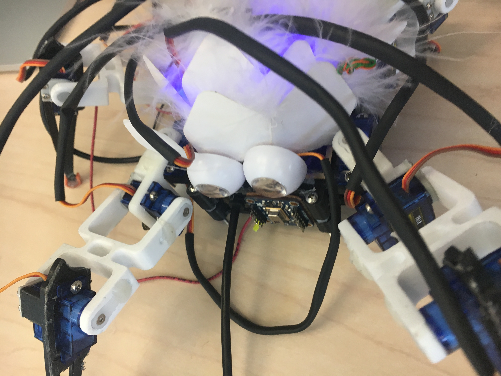
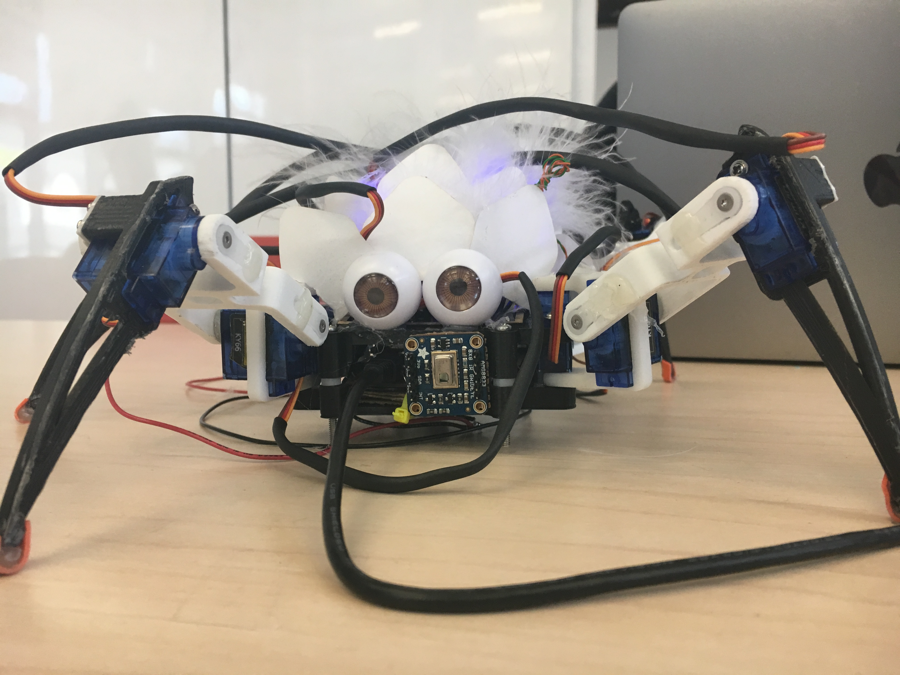
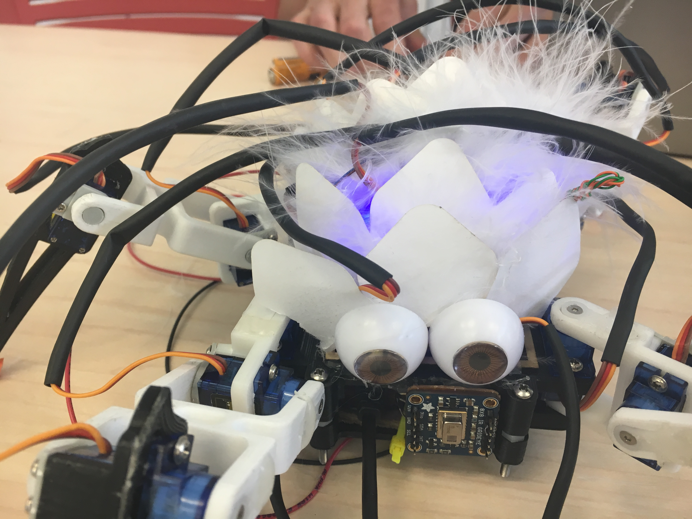
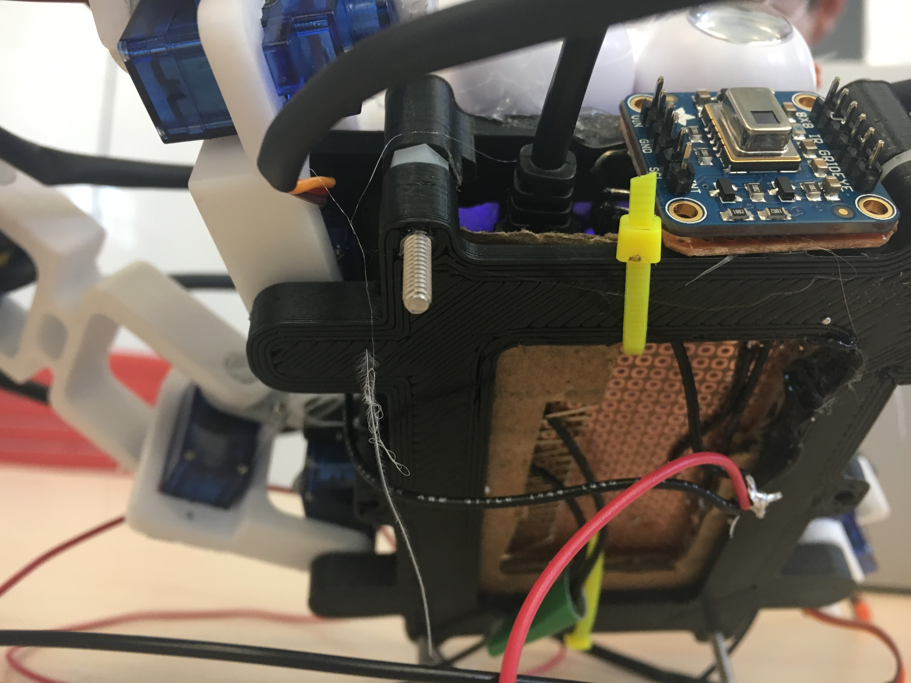

# Sid the Spider Bot

Adding interactivity to quadruped robots with thermal sensor integration

## Team

* Hadar Bar
* Winston Black
* Rohan Castelino
* Jordan Goodman

## Summary

Our primary hope for this project was to create a robot which helps people grow more comfortable with spiders. We hoped to help both reduce the average person’s fear of the the (mostly) harmless arachnids as well as to assist those who struggle with arachnophobia.

From a technical perspective, we wanted to take the standard quadruped robot (as designed in this case by Regis Hsu) and add an extra level of complexity/interactivity by integrating a thermal sensor. Our plan was to design a robot which could either be operated manually or could autonomously use the thermal sensor (above picture) to detect humans and move towards them via 4 3-segmented legs. Ultimately, we hoped to create a more customizable, modular robot that can be used with a wide range of sensors to collect different inputs, process them and react in varying ways. At the same time, we wanted to create an aesthetically pleasing robot. We wanted the final product both to move gracefully and look soothing and “cute” rather than frightening.

In the end, we successfully created a four-legged robot which can operate autonomously to detect heat sources and walk towards them. Unfortunately, though we accomplished our primary goals for the project, we were not able to integrate additional components we had planned for. Underestimating the time needed to fine-tune the complex, 3d printed mechanical legs (left), we did not have enough time to tackle creating a remote control for the robot. Furthermore, due to the quality of the servos we used, we were not able to mount the battery directly on the robot. However, we were still quite successful in creating a finished product. Our robot “Sid” can effectively detect where humans are and will try his best to move towards them!

## Component Parts

### Electrical and Mechanical Parts
12 microservos. Three for each leg
1 Lithium ion battery to power the servos (Replaced on day of presentation)
4 AA batteries (Added on day of presentation)
1 Voltage Converter (Removed on day of presentation)
1 DC Barrel Panel Mount (Removed on day of presentation)
1 AA battery pack (Added on day of presentation)
1 Adafruit feather board to control the spider’s movement
2 8-Channel PWM Servo FeatherWing for Adafruit Feather
1 Adafruit AMG8833 Thermal Camera

### 3D Printed Structural Parts
1 Lower Body
1 Upper Body
2 Left Side Coxas (Leg segment closest to body)
2 Right Side Coxas
4 Femurs (Middle leg segment)
2 Left Side Tibias (Extreme leg segment)
2 Right Side Tibias
12 S-Holds (Hold servos in place, allow for rotation)

### Software Parts
Thermal Camera Readouts (INPUT)
Servo Commands (OUTPUT)

### Block Diagram

## Challenges

- We experienced many servo failures, but were able to reduce the number over time by handling them more carefully and standardizing a safe calibration procedure.
- We had difficulties powering all 12 servos as they drew too much current and caused brown-outs in the micro controller. We fixed this by switching the micro controller power source to USB so it was separate from the servo power source.
- Adapting a (poorly documented) program to run our spider proved challenging to coordinate with the thermal camera code, and the coordinate system used made adding custom walks to the spider fairly challenging.
- On the day of the presentation, we had a last minute failure in our voltage converter, and as a result had to swap out the lightweight rechargable 12V battery for a 6V AA battery pack.

## Timeline
- Week 1: Proposal written
- Week 2: First iteration of spider body and legs printed and assembled. Electronic parts acquired, documentation studied.
- Week 3: Redesign of spider body and legs. Circuitry created.
- Week 4: Second iteration of spider body and legs printed and assembled. Basic tests with electronics. Programming begins. Debugging of most noticeable issues.
- Week 5: Programming completed. Debugging continued. Presented.

## Completed Work

## References and links

[Showcase writeup](Presentation Writeup V2.pdf)
[Inspiration and initial design](http://www.instructables.com/id/DIY-Spider-RobotQuad-robot-Quadruped/)
[Gait inspiration](https://makezine.com/2016/11/22/robot-quadruped-arduino-program/)
[Inverse kinematics](https://oscarliang.com/inverse-kinematics-implementation-hexapod-robots/)
[FeatherWing documentation](https://cdn-learn.adafruit.com/downloads/pdf/adafruit-8-channel-pwm-or-servo-featherwing.pdf)
[IR Camera documentation](https://www.adafruit.com/product/3538)
